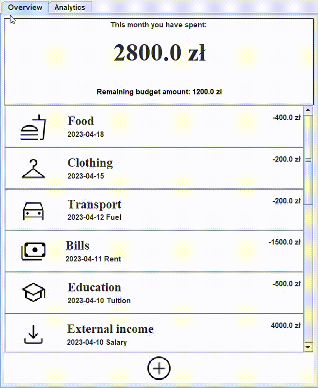

# Expenses-manager
A simple expenses tracking application written in Java.

## Installing
Packages to download will be available when I consider that it can be called version 1.0 :)

## Features
+ **Multiple local profiles:** You can create as many profiles as you want, for each new one there is a *.csv file created to keep track of expenses.
+ **Transactions overview:** Graphical representation of transactions, continuously updated values of current month's expenses and remaining budget.

For those who would rather see it in action, wait a moment, gif with a simple demo is loading beneath. 

Unfortunately, not much can be seen because the technology which I am using does not record pop-up menus, so here are some screens of logging and transaction creation/editing:
**Creating new profile**

**Logging in**

**Adding transaction**

**Updating/deleting transaction**

## Built with
JDK 20

## Future development
+ Financial analysis section an outline of which can be seen in the documentation -> (V.0.9.5)
+ Profile creation and authorization with your google account, data storage using google sheets -> (V.1.0)
+ Small improvements such as the ability to create your own categories and assign icons/colours to them -> (V.1.X)
